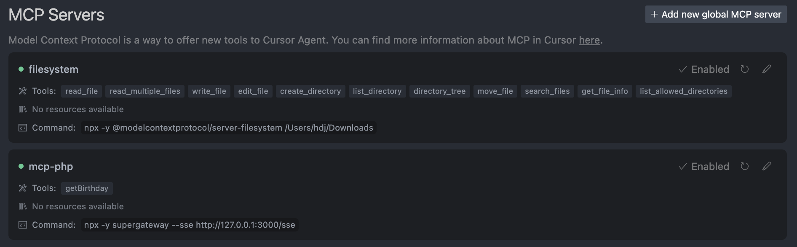
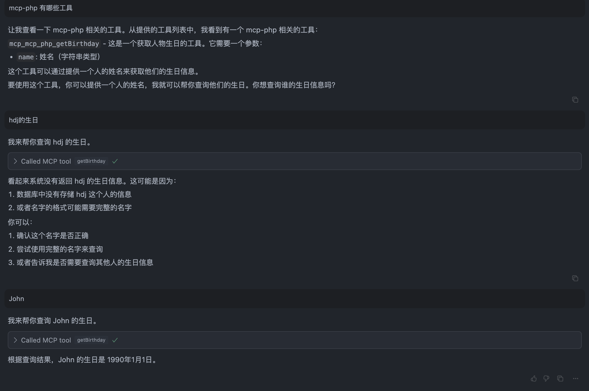

# MCP Demo

基于 Hyperf 框架的 MCP (Micro-service Control Protocol) 演示项目。

## 简介

本项目展示了如何使用 Hyperf 框架的 MCP 组件来构建和管理微服务工具。通过注解的方式，可以轻松地将类方法暴露为微服务工具。

## 特性

- 基于 Hyperf 框架
- 使用注解方式定义工具
- 支持工具描述和参数说明

## 安装

```bash
# 克隆项目
git clone https://github.com/huangdijia/mcp-demo.git

# 安装依赖
composer install

# 复制环境配置文件
cp .env.example .env

# 启动服务
php bin/hyperf.php start
```

## 使用方法

### mcp-sse server 配置

在 `config/autoload/server.php` 中添加以下配置：

```php
<?php

use Hyperf\Framework\Bootstrap\PipeMessageCallback;
use Hyperf\Framework\Bootstrap\WorkerExitCallback;
use Hyperf\Framework\Bootstrap\WorkerStartCallback;
use Hyperf\Mcp\Server\McpServer;
use Hyperf\Server\Event;
use Hyperf\Server\Server;
use Swoole\Constant;

return [
    'type' => Hyperf\Server\CoroutineServer::class, // !!!目前仅支持协程风格
    'mode' => SWOOLE_PROCESS,
    'servers' => [
        'http' => [
            'name' => 'http',
            'type' => Server::SERVER_HTTP,
            'host' => '0.0.0.0',
            'port' => 9501,
            'sock_type' => SWOOLE_SOCK_TCP,
            'callbacks' => [
                Event::ON_REQUEST => [Hyperf\HttpServer\Server::class, 'onRequest'],
            ],
            'options' => [
                // Whether to enable request lifecycle event
                'enable_request_lifecycle' => false,
            ],
        ],
        'mcp-sse' => [
            'name' => 'mcp-sse',
            'type' => Server::SERVER_HTTP,
            'host' => '0.0.0.0',
            'port' => 3000,
            'sock_type' => SWOOLE_SOCK_TCP,
            'callbacks' => [
                Event::ON_REQUEST => [McpServer::class, 'onRequest'],
                Event::ON_CLOSE => [McpServer::class, 'onClose'],
            ],
            'options' => [
                'mcp_path' => '/sse',
            ],
        ],
    ],
    'settings' => [
        Constant::OPTION_ENABLE_COROUTINE => true,
        Constant::OPTION_WORKER_NUM => swoole_cpu_num(),
        Constant::OPTION_PID_FILE => BASE_PATH . '/runtime/hyperf.pid',
        Constant::OPTION_OPEN_TCP_NODELAY => true,
        Constant::OPTION_MAX_COROUTINE => 100000,
        Constant::OPTION_OPEN_HTTP2_PROTOCOL => true,
        Constant::OPTION_MAX_REQUEST => 100000,
        Constant::OPTION_SOCKET_BUFFER_SIZE => 2 * 1024 * 1024,
        Constant::OPTION_BUFFER_OUTPUT_SIZE => 2 * 1024 * 1024,
    ],
    'callbacks' => [
        Event::ON_WORKER_START => [WorkerStartCallback::class, 'onWorkerStart'],
        Event::ON_PIPE_MESSAGE => [PipeMessageCallback::class, 'onPipeMessage'],
        Event::ON_WORKER_EXIT => [WorkerExitCallback::class, 'onWorkerExit'],
    ],
];

```

### 定义工具

使用 `#[Tool]` 和 `#[Description]` 注解来定义工具和参数说明：

```php
use Hyperf\Mcp\Annotation\Description;
use Hyperf\Mcp\Annotation\Tool;

class Foo
{
    #[Tool(
        name: 'getBirthday',
        description: 'Get the birthday of the person',
        serverName: 'mcp-sse'
    )]
    public function getBirthday(
        #[Description('姓名')]
        string $name
    ):mixed
    {
        return match ($name) {
            'John' => '1990-01-01',
            'Jane' => '1991-02-02',
            'Jack' => '1992-03-03',
            'Jill' => '1993-04-04',
            default => null,
        };
    }
}
```

### Cursor MCP 配置

要在 Cursor 中使用 MCP 工具，需要进行以下配置：

1. 在项目根目录下创建 `/Users/[your-name]/Library/Application Support/Claude/claude_desktop_config.json` 文件
2. 添加以下配置内容：

```json
{
  "mcpServers": {
    "mcp-php": {
      "command": "npx",
      "args": [
        "-y",
        "supergateway",
        "--sse",
        "http://127.0.0.1:3000/sse"
      ]
    }
  }
}
```



### 执行结果

在 Cursor 中调用 MCP 工具：



## 许可证

本项目使用 [LICENSE](LICENSE) 许可证。
